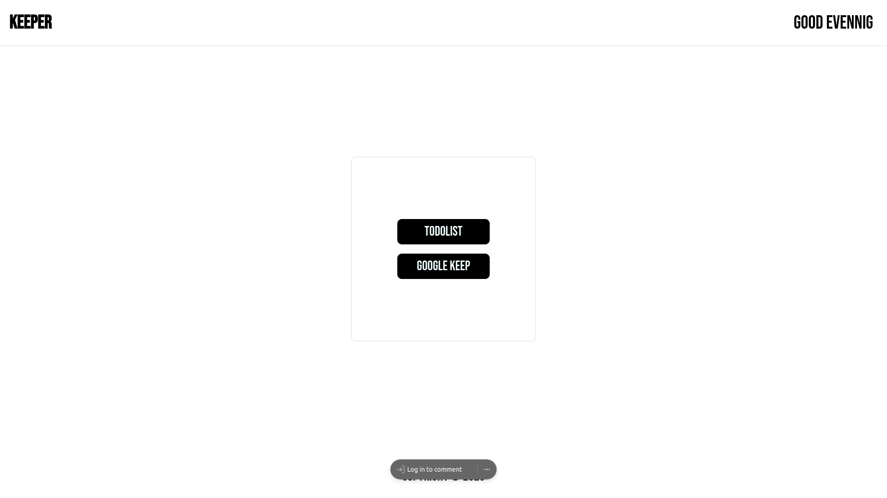

# Google Keep Clone

A Google Keep clone built using ReactJS.



## Table of Contents

- [Demo](#demo)
- [Features](#features)
- [Installation](#installation)
- [Usage](#usage)
- [Technologies Used](#technologies-used)
- [Contributing](#contributing)
- [License](#license)

## Features

- Create, edit, and delete notes.
- Responsive design for desktop and mobile.

## Installation

1. Clone the repository:

   ```bash
   git clone https://github.com/piscesmohsin/google-keep-clone.git
   cd google-keep-clone
   ```

2. Install dependencies:

   ```bash
   npm install
   ```

3. Start the development server:

   ```bash
   npm start
   ```

4. Open your browser and visit `http://localhost:3000` to see the app running.

## Usage

1. Create a new note by clicking the "+" button.
2. Edit a note by clicking on it.
3. Delete a note by clicking the trash icon.
4. Add labels to your notes for organization.
5. Change note colors using the color palette.
6. Search for notes using the search bar.

## Technologies Used

- ReactJS
- JavaScript
- CSS (for styling)
- Firebase (for data storage - optional)

## Contributing

Contributions are welcome! If you'd like to contribute to this project, please follow these steps:

1. Fork the repository.
2. Create a new branch for your feature: `git checkout -b feature-name`
3. Make your changes and commit them: `git commit -m 'Add feature'`
4. Push to the branch: `git push origin feature-name`
5. Create a pull request.

Please make sure to test your changes thoroughly before creating a pull request.

## License

This project is licensed under the MIT License - see the [LICENSE](LICENSE) file for details.

---

Feel free to customize this README as needed for your project. You can also include additional sections like "Deployment," "Testing," or "Acknowledgments" depending on the complexity and requirements of your Google Keep clone project.


